# 🎯 Guia Completo de Desenvolvimento - Sistema Profissional de Rifas Online

## 📋 Sumário Executivo

Este documento é o guia definitivo para desenvolvimento de um sistema profissional de rifas online no Brasil, combinando análise de mercado, arquitetura técnica moderna e conformidade legal completa. O sistema será desenvolvido usando **Next.js 14**, **React**, **Supabase**, **shadcn/ui** e integrações com **PIX**, **Loteria Federal** e **WhatsApp/SMS**.

### Objetivos do Projeto
- ✅ Criar plataforma de rifas online para múltiplas campanhas simultâneas
- ✅ Autenticação via telefone celular com verificação SMS/WhatsApp
- ✅ Pagamento instantâneo via PIX com confirmação automática
- ✅ Sorteios transparentes usando Loteria Federal
- ✅ Painel administrativo completo
- ✅ Interface responsiva e moderna (mobile-first)
- ✅ Conformidade com LGPD e regulamentações brasileiras

### Métricas de Sucesso
- Suportar 100.000+ usuários simultâneos
- Processar 10.000+ transações/hora
- 99.9% uptime
- Confirmação de pagamento < 5 segundos
- Taxa de conversão > 15%

---

## 🏗️ Arquitetura Técnica e Stack

### Stack Principal

```yaml
Frontend:
  - Framework: Next.js 14 (App Router)
  - UI Library: React 18
  - Styling: Tailwind CSS + shadcn/ui
  - State Management: Zustand / React Context
  - Forms: React Hook Form + Zod
  - Realtime: Supabase Realtime

Backend:
  - Database: Supabase (PostgreSQL)
  - Auth: Supabase Auth + Custom Phone Auth
  - Storage: Supabase Storage
  - API: Next.js API Routes
  - Queue: BullMQ (Redis) para jobs assíncronos

Integrações:
  - Pagamento: API Partner (documentação fornecida)
  - SMS/WhatsApp: Twilio / Amazon SNS
  - Loteria: APIs agregadoras (Lotodicas, etc)
  - Analytics: Google Analytics 4 + Facebook Pixel
  - Monitoring: Sentry + Vercel Analytics

Infraestrutura:
  - Hosting: Vercel (Next.js)
  - Database: Supabase Cloud
  - CDN: Cloudflare
  - Redis: Upstash
```

### Diagrama de Arquitetura


---

## 💾 Estrutura Completa do Banco de Dados

### 1. Schema de Autenticação e Usuários

```sql
-- Extensões necessárias
CREATE EXTENSION IF NOT EXISTS "uuid-ossp";
CREATE EXTENSION IF NOT EXISTS "pg_trgm"; -- Para busca fuzzy
CREATE EXTENSION IF NOT EXISTS "unaccent"; -- Para busca sem acentos

-- Tabela de perfis de usuários (estende auth.users do Supabase)
CREATE TABLE public.profiles (
    id UUID REFERENCES auth.users(id) ON DELETE CASCADE PRIMARY KEY,
    phone VARCHAR(15) UNIQUE NOT NULL,
    phone_verified BOOLEAN DEFAULT FALSE,
    phone_verified_at TIMESTAMPTZ,
    cpf VARCHAR(11) UNIQUE NOT NULL,
    full_name VARCHAR(255) NOT NULL,
    birth_date DATE NOT NULL,
    email VARCHAR(255),
    
    -- Sistema de referência/afiliados
    referral_code VARCHAR(10) UNIQUE DEFAULT generate_referral_code(),
    referred_by UUID REFERENCES profiles(id),
    referral_count INTEGER DEFAULT 0,
    
    -- Estatísticas do usuário
    total_spent DECIMAL(12,2) DEFAULT 0,
    total_won DECIMAL(12,2) DEFAULT 0,
    total_tickets_bought INTEGER DEFAULT 0,
    raffles_won INTEGER DEFAULT 0,
    
    -- Gamificação
    points INTEGER DEFAULT 0,
    level INTEGER DEFAULT 1,
    badges JSONB DEFAULT '[]'::jsonb,
    
    -- Preferências
    preferences JSONB DEFAULT '{
        "notifications": {
            "sms": true,
            "whatsapp": true,
            "email": true,
            "push": false
        },
        "marketing": false
    }'::jsonb,
    
    -- Metadados
    metadata JSONB DEFAULT '{}'::jsonb,
    last_login_at TIMESTAMPTZ,
    created_at TIMESTAMPTZ DEFAULT NOW(),
    updated_at TIMESTAMPTZ DEFAULT NOW(),
    
    CONSTRAINT valid_cpf CHECK (cpf ~ '^[0-9]{11}$'),
    CONSTRAINT valid_phone CHECK (phone ~ '^\+55[0-9]{10,11}$'),
    CONSTRAINT adult_only CHECK (birth_date <= CURRENT_DATE - INTERVAL '18 years')
);

-- Função para gerar código de referência único
CREATE OR REPLACE FUNCTION generate_referral_code()
RETURNS VARCHAR AS $$
DECLARE
    chars VARCHAR := 'ABCDEFGHIJKLMNOPQRSTUVWXYZ0123456789';
    result VARCHAR := '';
    i INTEGER;
BEGIN
    FOR i IN 1..8 LOOP
        result := result || substr(chars, floor(random() * length(chars) + 1)::int, 1);
    END LOOP;
    RETURN result;
END;
$$ LANGUAGE plpgsql;

-- Tabela de OTP para verificação de telefone
CREATE TABLE public.otp_codes (
    id UUID DEFAULT uuid_generate_v4() PRIMARY KEY,
    phone VARCHAR(15) NOT NULL,
    code VARCHAR(6) NOT NULL,
    type VARCHAR(20) DEFAULT 'verification', -- verification, login, reset
    attempts INTEGER DEFAULT 0,
    used BOOLEAN DEFAULT FALSE,
    expires_at TIMESTAMPTZ NOT NULL,
    created_at TIMESTAMPTZ DEFAULT NOW(),
    
    INDEX idx_otp_phone_code (phone, code),
    INDEX idx_otp_expires (expires_at)
);
```

### 2. Schema de Rifas e Campanhas

```sql
-- Tabela principal de rifas/campanhas
CREATE TABLE public.raffles (
    id UUID DEFAULT uuid_generate_v4() PRIMARY KEY,
    
    -- Informações básicas
    title VARCHAR(255) NOT NULL,
    slug VARCHAR(255) UNIQUE NOT NULL,
    description TEXT NOT NULL,
    rules TEXT,
    
    -- Prêmio
    prize_name VARCHAR(255) NOT NULL,
    prize_description TEXT NOT NULL,
    prize_value DECIMAL(12,2) NOT NULL,
    prize_images JSONB DEFAULT '[]'::jsonb,
    
    -- Configuração de bilhetes
    ticket_price DECIMAL(8,2) NOT NULL,
    total_tickets INTEGER NOT NULL,
    tickets_sold INTEGER DEFAULT 0,
    min_tickets_to_draw INTEGER DEFAULT 1,
    max_tickets_per_user INTEGER, -- NULL = sem limite
    
    -- Status e datas
    status VARCHAR(20) DEFAULT 'draft',
    draw_type VARCHAR(20) DEFAULT 'date', -- date, sold_out, manual
    draw_date TIMESTAMPTZ,
    drawn_at TIMESTAMPTZ,
    
    -- Integração Loteria Federal
    lottery_type VARCHAR(20) DEFAULT 'federal',
    lottery_contest INTEGER,
    lottery_draw_rules JSONB DEFAULT '{
        "type": "federal_1st",
        "description": "Usa os 5 dígitos do 1º prêmio da Loteria Federal"
    }'::jsonb,
    
    -- Resultado do sorteio
    winning_number INTEGER,
    winner_id UUID REFERENCES profiles(id),
    lottery_results JSONB, -- Resultados oficiais da loteria
    
    -- Funcionalidades extras
    featured BOOLEAN DEFAULT FALSE,
    featured_until TIMESTAMPTZ,
    instant_prizes JSONB DEFAULT '[]'::jsonb, -- Bilhetes premiados
    top_buyers_prizes JSONB DEFAULT '[]'::jsonb, -- Prêmios para ranking
    
    -- Metadados e controle
    created_by UUID REFERENCES profiles(id) NOT NULL,
    metadata JSONB DEFAULT '{}'::jsonb,
    created_at TIMESTAMPTZ DEFAULT NOW(),
    updated_at TIMESTAMPTZ DEFAULT NOW(),
    published_at TIMESTAMPTZ,
    finished_at TIMESTAMPTZ,
    
    CONSTRAINT valid_status CHECK (status IN ('draft', 'active', 'paused', 'sold_out', 'drawing', 'completed', 'cancelled')),
    CONSTRAINT valid_draw_type CHECK (draw_type IN ('date', 'sold_out', 'manual')),
    CONSTRAINT valid_lottery CHECK (lottery_type IN ('federal', 'mega_sena', 'quina', 'manual'))
);

-- Tabela de números/bilhetes
CREATE TABLE public.tickets (
    id UUID DEFAULT uuid_generate_v4() PRIMARY KEY,
    raffle_id UUID REFERENCES raffles(id) ON DELETE CASCADE NOT NULL,
    number INTEGER NOT NULL,
    
    -- Status e propriedade
    status VARCHAR(20) DEFAULT 'available',
    owner_id UUID REFERENCES profiles(id),
    transaction_id UUID REFERENCES transactions(id),
    
    -- Reserva temporária
    reserved_by UUID REFERENCES profiles(id),
    reserved_until TIMESTAMPTZ,
    
    -- Prêmio instantâneo
    instant_prize JSONB,
    instant_prize_claimed BOOLEAN DEFAULT FALSE,
    
    -- Timestamps
    reserved_at TIMESTAMPTZ,
    sold_at TIMESTAMPTZ,
    created_at TIMESTAMPTZ DEFAULT NOW(),
    
    UNIQUE(raffle_id, number),
    CONSTRAINT valid_status CHECK (status IN ('available', 'reserved', 'sold')),
    INDEX idx_tickets_raffle_status (raffle_id, status),
    INDEX idx_tickets_owner (owner_id),
    INDEX idx_tickets_reserved (reserved_until) WHERE status = 'reserved'
);

-- Tabela de estatísticas de rifas (materializada para performance)
CREATE TABLE public.raffle_stats (
    raffle_id UUID REFERENCES raffles(id) ON DELETE CASCADE PRIMARY KEY,
    total_revenue DECIMAL(12,2) DEFAULT 0,
    unique_buyers INTEGER DEFAULT 0,
    avg_tickets_per_buyer DECIMAL(8,2) DEFAULT 0,
    top_buyer_id UUID REFERENCES profiles(id),
    top_buyer_amount DECIMAL(10,2) DEFAULT 0,
    last_sale_at TIMESTAMPTZ,
    sales_velocity DECIMAL(8,2), -- vendas por hora
    estimated_completion TIMESTAMPTZ,
    updated_at TIMESTAMPTZ DEFAULT NOW()
);
```

### 3. Schema de Transações e Pagamentos

```sql
-- Tabela de transações
CREATE TABLE public.transactions (
    id UUID DEFAULT uuid_generate_v4() PRIMARY KEY,
    
    -- Relacionamentos
    user_id UUID REFERENCES profiles(id) NOT NULL,
    raffle_id UUID REFERENCES raffles(id) NOT NULL,
    
    -- Valores
    subtotal DECIMAL(10,2) NOT NULL,
    discount_amount DECIMAL(8,2) DEFAULT 0,
    total_amount DECIMAL(10,2) NOT NULL,
    
    -- Pagamento
    payment_method VARCHAR(20) NOT NULL,
    payment_gateway VARCHAR(30) NOT NULL,
    gateway_transaction_id VARCHAR(255),
    gateway_response JSONB,
    
    -- PIX específico
    pix_code TEXT,
    pix_qrcode TEXT,
    pix_expires_at TIMESTAMPTZ,
    
    -- Status
    status VARCHAR(20) DEFAULT 'pending',
    
    -- Cupom e afiliado
    coupon_id UUID REFERENCES coupons(id),
    affiliate_id UUID REFERENCES profiles(id),
    commission_rate DECIMAL(5,2),
    commission_amount DECIMAL(8,2) DEFAULT 0,
    commission_paid BOOLEAN DEFAULT FALSE,
    
    -- Metadados
    ip_address INET,
    user_agent TEXT,
    metadata JSONB DEFAULT '{}'::jsonb,
    
    -- Timestamps
    paid_at TIMESTAMPTZ,
    failed_at TIMESTAMPTZ,
    refunded_at TIMESTAMPTZ,
    created_at TIMESTAMPTZ DEFAULT NOW(),
    updated_at TIMESTAMPTZ DEFAULT NOW(),
    
    CONSTRAINT valid_payment_method CHECK (payment_method IN ('pix', 'credit_card', 'debit_card', 'boleto')),
    CONSTRAINT valid_status CHECK (status IN ('pending', 'processing', 'paid', 'failed', 'cancelled', 'refunded')),
    INDEX idx_transactions_user (user_id),
    INDEX idx_transactions_status (status),
    INDEX idx_transactions_gateway (gateway_transaction_id)
);

-- Tabela de itens da transação (bilhetes comprados)
CREATE TABLE public.transaction_items (
    id UUID DEFAULT uuid_generate_v4() PRIMARY KEY,
    transaction_id UUID REFERENCES transactions(id) ON DELETE CASCADE NOT NULL,
    ticket_id UUID REFERENCES tickets(id) NOT NULL,
    ticket_number INTEGER NOT NULL,
    price DECIMAL(8,2) NOT NULL,
    created_at TIMESTAMPTZ DEFAULT NOW()
);

-- Tabela de webhooks de pagamento
CREATE TABLE public.payment_webhooks (
    id UUID DEFAULT uuid_generate_v4() PRIMARY KEY,
    gateway VARCHAR(30) NOT NULL,
    event_type VARCHAR(50) NOT NULL,
    transaction_id VARCHAR(255),
    payload JSONB NOT NULL,
    processed BOOLEAN DEFAULT FALSE,
    processed_at TIMESTAMPTZ,
    error TEXT,
    created_at TIMESTAMPTZ DEFAULT NOW(),
    
    INDEX idx_webhooks_transaction (transaction_id),
    INDEX idx_webhooks_processed (processed, created_at)
);

-- Tabela de cupons de desconto
CREATE TABLE public.coupons (
    id UUID DEFAULT uuid_generate_v4() PRIMARY KEY,
    code VARCHAR(20) UNIQUE NOT NULL,
    description TEXT,
    
    -- Tipo e valor do desconto
    discount_type VARCHAR(20) NOT NULL, -- percentage, fixed
    discount_value DECIMAL(8,2) NOT NULL,
    min_purchase_amount DECIMAL(10,2),
    
    -- Limites
    usage_limit INTEGER,
    usage_count INTEGER DEFAULT 0,
    usage_per_user INTEGER DEFAULT 1,
    
    -- Validade
    valid_from TIMESTAMPTZ DEFAULT NOW(),
    valid_until TIMESTAMPTZ,
    
    -- Aplicabilidade
    raffle_id UUID REFERENCES raffles(id), -- NULL = todas as rifas
    active BOOLEAN DEFAULT TRUE,
    
    created_by UUID REFERENCES profiles(id),
    created_at TIMESTAMPTZ DEFAULT NOW(),
    
    CONSTRAINT valid_discount_type CHECK (discount_type IN ('percentage', 'fixed'))
);
```

### 4. Schema de Gestão e Analytics

```sql
-- Tabela de ganhadores
CREATE TABLE public.winners (
    id UUID DEFAULT uuid_generate_v4() PRIMARY KEY,
    raffle_id UUID REFERENCES raffles(id) NOT NULL,
    user_id UUID REFERENCES profiles(id) NOT NULL,
    winning_number INTEGER NOT NULL,
    prize_value DECIMAL(12,2) NOT NULL,
    
    -- Entrega do prêmio
    prize_claimed BOOLEAN DEFAULT FALSE,
    claimed_at TIMESTAMPTZ,
    delivery_status VARCHAR(20) DEFAULT 'pending',
    delivery_notes TEXT,
    
    -- Documentação
    documents_received JSONB DEFAULT '[]'::jsonb,
    documents_verified BOOLEAN DEFAULT FALSE,
    
    -- Publicação
    public_display BOOLEAN DEFAULT TRUE,
    testimonial TEXT,
    photo_url TEXT,
    
    created_at TIMESTAMPTZ DEFAULT NOW(),
    updated_at TIMESTAMPTZ DEFAULT NOW(),
    
    CONSTRAINT valid_delivery CHECK (delivery_status IN ('pending', 'contacted', 'documenting', 'processing', 'delivered', 'cancelled'))
);

-- Tabela de notificações
CREATE TABLE public.notifications (
    id UUID DEFAULT uuid_generate_v4() PRIMARY KEY,
    user_id UUID REFERENCES profiles(id) NOT NULL,
    type VARCHAR(30) NOT NULL,
    channel VARCHAR(20) NOT NULL,
    
    -- Conteúdo
    title VARCHAR(255),
    message TEXT NOT NULL,
    data JSONB DEFAULT '{}'::jsonb,
    
    -- Status
    status VARCHAR(20) DEFAULT 'pending',
    sent_at TIMESTAMPTZ,
    read_at TIMESTAMPTZ,
    error TEXT,
    
    created_at TIMESTAMPTZ DEFAULT NOW(),
    
    CONSTRAINT valid_type CHECK (type IN ('otp', 'payment_confirmed', 'raffle_result', 'winner', 'marketing', 'system')),
    CONSTRAINT valid_channel CHECK (channel IN ('sms', 'whatsapp', 'email', 'push', 'in_app')),
    CONSTRAINT valid_status CHECK (status IN ('pending', 'sent', 'delivered', 'failed', 'cancelled'))
);

-- Tabela de afiliados/comissões
CREATE TABLE public.affiliate_stats (
    user_id UUID REFERENCES profiles(id) PRIMARY KEY,
    total_referrals INTEGER DEFAULT 0,
    active_referrals INTEGER DEFAULT 0,
    total_sales DECIMAL(12,2) DEFAULT 0,
    total_commission DECIMAL(10,2) DEFAULT 0,
    paid_commission DECIMAL(10,2) DEFAULT 0,
    pending_commission DECIMAL(10,2) DEFAULT 0,
    
    -- Níveis de afiliado
    tier VARCHAR(20) DEFAULT 'bronze', -- bronze, silver, gold, diamond
    commission_rate DECIMAL(5,2) DEFAULT 5.00,
    
    -- Performance
    conversion_rate DECIMAL(5,2),
    avg_ticket_value DECIMAL(8,2),
    best_month_sales DECIMAL(10,2),
    
    updated_at TIMESTAMPTZ DEFAULT NOW(),
    
    CONSTRAINT valid_tier CHECK (tier IN ('bronze', 'silver', 'gold', 'diamond'))
);

-- Tabela de logs de auditoria
CREATE TABLE public.audit_logs (
    id UUID DEFAULT uuid_generate_v4() PRIMARY KEY,
    user_id UUID REFERENCES profiles(id),
    action VARCHAR(50) NOT NULL,
    entity_type VARCHAR(30) NOT NULL,
    entity_id UUID,
    
    -- Detalhes
    old_values JSONB,
    new_values JSONB,
    metadata JSONB DEFAULT '{}'::jsonb,
    
    -- Contexto
    ip_address INET,
    user_agent TEXT,
    
    created_at TIMESTAMPTZ DEFAULT NOW(),
    
    INDEX idx_audit_user (user_id),
    INDEX idx_audit_entity (entity_type, entity_id),
    INDEX idx_audit_created (created_at)
);
```

### 5. Funções e Triggers Automatizados

```sql
-- Trigger para atualizar updated_at automaticamente
CREATE OR REPLACE FUNCTION update_updated_at_column()
RETURNS TRIGGER AS $$
BEGIN
    NEW.updated_at = NOW();
    RETURN NEW;
END;
$$ LANGUAGE plpgsql;

-- Aplicar trigger em todas as tabelas relevantes
CREATE TRIGGER update_profiles_updated_at BEFORE UPDATE ON profiles
    FOR EACH ROW EXECUTE FUNCTION update_updated_at_column();
CREATE TRIGGER update_raffles_updated_at BEFORE UPDATE ON raffles
    FOR EACH ROW EXECUTE FUNCTION update_updated_at_column();
-- ... aplicar para outras tabelas

-- Função para atualizar contador de tickets vendidos
CREATE OR REPLACE FUNCTION update_raffle_tickets_sold()
RETURNS TRIGGER AS $$
BEGIN
    IF TG_OP = 'UPDATE' AND OLD.status != 'sold' AND NEW.status = 'sold' THEN
        UPDATE raffles 
        SET tickets_sold = tickets_sold + 1
        WHERE id = NEW.raffle_id;
        
        -- Atualizar estatísticas
        PERFORM update_raffle_stats(NEW.raffle_id);
    END IF;
    RETURN NEW;
END;
$$ LANGUAGE plpgsql;

CREATE TRIGGER update_tickets_sold_trigger
AFTER UPDATE OF status ON tickets
FOR EACH ROW
EXECUTE FUNCTION update_raffle_tickets_sold();

-- Função para liberar tickets reservados expirados
CREATE OR REPLACE FUNCTION release_expired_reservations()
RETURNS void AS $$
BEGIN
    UPDATE tickets
    SET status = 'available',
        reserved_by = NULL,
        reserved_until = NULL,
        reserved_at = NULL
    WHERE status = 'reserved' 
    AND reserved_until < NOW();
END;
$$ LANGUAGE plpgsql;

-- Agendar execução periódica (a cada minuto)
SELECT cron.schedule('release-expired-tickets', '* * * * *', 'SELECT release_expired_reservations()');

-- Função para selecionar vencedor baseado na Loteria Federal
CREATE OR REPLACE FUNCTION select_winner_by_lottery(
    p_raffle_id UUID,
    p_lottery_results JSONB
) RETURNS INTEGER AS $$
DECLARE
    v_winning_number INTEGER;
    v_raffle RECORD;
    v_winner_id UUID;
BEGIN
    -- Buscar configuração da rifa
    SELECT * INTO v_raffle FROM raffles WHERE id = p_raffle_id;
    
    -- Calcular número vencedor baseado nas regras
    CASE v_raffle.lottery_draw_rules->>'type'
        WHEN 'federal_1st' THEN
            -- Usar 5 dígitos do 1º prêmio
            v_winning_number := (p_lottery_results->>'premio1')::INTEGER;
        WHEN 'federal_combined' THEN
            -- Combinar dígitos de múltiplos prêmios
            v_winning_number := (
                RIGHT(p_lottery_results->>'premio1', 5) || 
                RIGHT(p_lottery_results->>'premio2', 1)
            )::INTEGER;
        ELSE
            RAISE EXCEPTION 'Tipo de sorteio não suportado';
    END CASE;
    
    -- Verificar se o número foi vendido
    SELECT owner_id INTO v_winner_id
    FROM tickets
    WHERE raffle_id = p_raffle_id 
    AND number = v_winning_number
    AND status = 'sold';
    
    IF v_winner_id IS NULL THEN
        -- Regra de contingência: próximo número vendido
        SELECT owner_id, number INTO v_winner_id, v_winning_number
        FROM tickets
        WHERE raffle_id = p_raffle_id 
        AND status = 'sold'
        AND number > v_winning_number
        ORDER BY number
        LIMIT 1;
        
        IF v_winner_id IS NULL THEN
            -- Se não houver acima, pegar o menor vendido
            SELECT owner_id, number INTO v_winner_id, v_winning_number
            FROM tickets
            WHERE raffle_id = p_raffle_id 
            AND status = 'sold'
            ORDER BY number
            LIMIT 1;
        END IF;
    END IF;
    
    -- Atualizar rifa com vencedor
    UPDATE raffles
    SET winning_number = v_winning_number,
        winner_id = v_winner_id,
        lottery_results = p_lottery_results,
        status = 'completed',
        drawn_at = NOW(),
        finished_at = NOW()
    WHERE id = p_raffle_id;
    
    -- Registrar vencedor
    INSERT INTO winners (raffle_id, user_id, winning_number, prize_value)
    SELECT p_raffle_id, v_winner_id, v_winning_number, prize_value
    FROM raffles WHERE id = p_raffle_id;
    
    -- Criar notificação para o vencedor
    INSERT INTO notifications (user_id, type, channel, title, message, data)
    VALUES (
        v_winner_id,
        'winner',
        'whatsapp',
        'PARABÉNS! VOCÊ GANHOU!',
        'Você foi o ganhador da rifa! Entre em contato para receber seu prêmio.',
        jsonb_build_object('raffle_id', p_raffle_id, 'number', v_winning_number)
    );
    
    RETURN v_winning_number;
END;
$$ LANGUAGE plpgsql SECURITY DEFINER;

-- RLS (Row Level Security) Policies
ALTER TABLE profiles ENABLE ROW LEVEL SECURITY;
ALTER TABLE raffles ENABLE ROW LEVEL SECURITY;
ALTER TABLE tickets ENABLE ROW LEVEL SECURITY;
ALTER TABLE transactions ENABLE ROW LEVEL SECURITY;

-- Políticas de segurança
CREATE POLICY "Users can view own profile" ON profiles
    FOR SELECT USING (auth.uid() = id);

CREATE POLICY "Users can update own profile" ON profiles
    FOR UPDATE USING (auth.uid() = id)
    WITH CHECK (auth.uid() = id);

CREATE POLICY "Public can view active raffles" ON raffles
    FOR SELECT USING (status IN ('active', 'sold_out', 'completed'));

CREATE POLICY "Users can view own tickets" ON tickets
    FOR SELECT USING (owner_id = auth.uid() OR status = 'available');

CREATE POLICY "Users can view own transactions" ON transactions
    FOR SELECT USING (user_id = auth.uid());

-- Índices para performance
CREATE INDEX idx_profiles_referral ON profiles(referral_code);
CREATE INDEX idx_raffles_status_featured ON raffles(status, featured) WHERE featured = TRUE;
CREATE INDEX idx_tickets_composite ON tickets(raffle_id, status, number);
CREATE INDEX idx_transactions_composite ON transactions(user_id, status, created_at);
CREATE INDEX idx_notifications_user_unread ON notifications(user_id, read_at) WHERE read_at IS NULL;
```

---

## 📁 Estrutura Completa do Projeto Next.js

```bash
raffle-system/
├── .env.local                    # Variáveis de ambiente
├── .env.example                  # Template de variáveis
├── next.config.js                # Configuração Next.js
├── tailwind.config.ts            # Configuração Tailwind
├── components.json               # Configuração shadcn/ui
├── package.json
├── tsconfig.json
├── middleware.ts                 # Middleware de autenticação
│
├── public/
│   ├── manifest.json            # PWA manifest
│   ├── service-worker.js        # PWA service worker
│   └── images/
│       ├── logo.svg
│       └── og-image.jpg
│
├── src/
│   ├── app/                     # App Router (Next.js 14)
│   │   ├── layout.tsx           # Layout raiz
│   │   ├── page.tsx             # Homepage
│   │   ├── globals.css          # Estilos globais
│   │   ├── manifest.ts          # Metadados PWA
│   │   │
│   │   ├── (auth)/              # Grupo de autenticação
│   │   │   ├── login/
│   │   │   │   ├── page.tsx
│   │   │   │   └── components/
│   │   │   │       ├── PhoneLoginForm.tsx
│   │   │   │       └── OtpVerification.tsx
│   │   │   ├── cadastro/
│   │   │   │   ├── page.tsx
│   │   │   │   └── components/
│   │   │   │       └── RegistrationWizard.tsx
│   │   │   └── layout.tsx
│   │   │
│   │   ├── (dashboard)/         # Área do usuário
│   │   │   ├── minha-conta/
│   │   │   │   ├── page.tsx
│   │   │   │   ├── meus-numeros/page.tsx
│   │   │   │   ├── historico/page.tsx
│   │   │   │   ├── afiliados/page.tsx
│   │   │   │   └── configuracoes/page.tsx
│   │   │   └── layout.tsx
│   │   │
│   │   ├── (admin)/            # Painel administrativo
│   │   │   ├── admin/
│   │   │   │   ├── page.tsx    # Dashboard
│   │   │   │   ├── rifas/
│   │   │   │   │   ├── page.tsx
│   │   │   │   │   ├── criar/page.tsx
│   │   │   │   │   ├── [id]/
│   │   │   │   │   │   ├── page.tsx
│   │   │   │   │   │   ├── editar/page.tsx
│   │   │   │   │   │   └── sorteio/page.tsx
│   │   │   │   ├── usuarios/
│   │   │   │   │   ├── page.tsx
│   │   │   │   │   └── [id]/page.tsx
│   │   │   │   ├── transacoes/
│   │   │   │   │   └── page.tsx
│   │   │   │   ├── ganhadores/
│   │   │   │   │   └── page.tsx
│   │   │   │   ├── relatorios/
│   │   │   │   │   └── page.tsx
│   │   │   │   └── configuracoes/
│   │   │   │       └── page.tsx
│   │   │   └── layout.tsx
│   │   │
│   │   ├── rifas/              # Páginas públicas de rifas
│   │   │   ├── page.tsx        # Lista de rifas
│   │   │   └── [slug]/
│   │   │       ├── page.tsx
│   │   │       ├── loading.tsx
│   │   │       └── components/
│   │   │           ├── RaffleHeader.tsx
│   │   │           ├── TicketSelector.tsx
│   │   │           ├── PaymentModal.tsx
│   │   │           └── ShareButtons.tsx
│   │   │
│   │   ├── ganhadores/         # Página de ganhadores
│   │   │   └── page.tsx
│   │   │
│   │   ├── termos/             # Páginas legais
│   │   │   ├── page.tsx
│   │   │   ├── privacidade/page.tsx
│   │   │   └── regulamento/page.tsx
│   │   │
│   │   └── api/                # API Routes
│   │       ├── auth/
│   │       │   ├── send-otp/route.ts
│   │       │   ├── verify-otp/route.ts
│   │       │   └── logout/route.ts
│   │       │
│   │       ├── raffles/
│   │       │   ├── route.ts
│   │       │   ├── [id]/
│   │       │   │   ├── route.ts
│   │       │   │   ├── tickets/route.ts
│   │       │   │   └── stats/route.ts
│   │       │
│   │       ├── tickets/
│   │       │   ├── reserve/route.ts
│   │       │   └── release/route.ts
│   │       │
│   │       ├── payments/
│   │       │   ├── create-pix/route.ts
│   │       │   ├── check-status/route.ts
│   │       │   └── webhook/
│   │       │       └── [gateway]/route.ts
│   │       │
│   │       ├── lottery/
│   │       │   ├── check-results/route.ts
│   │       │   └── process-draw/route.ts
│   │       │
│   │       ├── notifications/
│   │       │   ├── send/route.ts
│   │       │   └── templates/route.ts
│   │       │
│   │       ├── admin/
│   │       │   ├── stats/route.ts
│   │       │   ├── reports/route.ts
│   │       │   └── users/route.ts
│   │       │
│   │       └── cron/
│   │           ├── release-tickets/route.ts
│   │           ├── check-payments/route.ts
│   │           └── lottery-results/route.ts
│   │
│   ├── components/             # Componentes reutilizáveis
│   │   ├── ui/                # shadcn/ui components
│   │   │   ├── button.tsx
│   │   │   ├── card.tsx
│   │   │   ├── dialog.tsx
│   │   │   ├── form.tsx
│   │   │   ├── input.tsx
│   │   │   ├── select.tsx
│   │   │   ├── table.tsx
│   │   │   ├── tabs.tsx
│   │   │   ├── toast.tsx
│   │   │   └── ...
│   │   │
│   │   ├── layout/
│   │   │   ├── Header.tsx
│   │   │   ├── Footer.tsx
│   │   │   ├── MobileNav.tsx
│   │   │   └── AdminSidebar.tsx
│   │   │
│   │   ├── features/
│   │   │   ├── RaffleCard.tsx
│   │   │   ├── TicketGrid.tsx
│   │   │   ├── CountdownTimer.tsx
│   │   │   ├── PaymentStatus.tsx
│   │   │   ├── WinnerBanner.tsx
│   │   │   ├── ShareModal.tsx
│   │   │   ├── StatsCard.tsx
│   │   │   └── RankingTable.tsx
│   │   │
│   │   └── shared/
│   │       ├── LoadingSpinner.tsx
│   │       ├── ErrorBoundary.tsx
│   │       ├── SEO.tsx
│   │       └── ConfirmDialog.tsx
│   │
│   ├── lib/                    # Bibliotecas e utilidades
│   │   ├── supabase/
│   │   │   ├── client.ts       # Cliente browser
│   │   │   ├── server.ts       # Cliente servidor
│   │   │   ├── admin.ts        # Cliente admin
│   │   │   └── middleware.ts   # Middleware auth
│   │   │
│   │   ├── api/
│   │   │   ├── payment.ts      # Integração pagamento
│   │   │   ├── lottery.ts      # Integração loteria
│   │   │   ├── sms.ts         # Twilio/SMS
│   │   │   └── whatsapp.ts    # WhatsApp Business
│   │   │
│   │   ├── utils/
│   │   │   ├── validation.ts   # Schemas Zod
│   │   │   ├── formatting.ts   # Formatadores
│   │   │   ├── cpf.ts         # Validação CPF
│   │   │   ├── phone.ts       # Formatação telefone
│   │   │   ├── currency.ts    # Formatação moeda
│   │   │   └── date.ts        # Formatação data
│   │   │
│   │   ├── constants/
│   │   │   ├── config.ts      # Configurações
│   │   │   ├── messages.ts    # Mensagens sistema
│   │   │   └── routes.ts      # Rotas aplicação
│   │   │
│   │   └── services/
│   │       ├── RaffleService.ts
│   │       ├── PaymentService.ts
│   │       ├── NotificationService.ts
│   │       └── LotteryService.ts
│   │
│   ├── hooks/                  # Custom React Hooks
│   │   ├── useAuth.ts
│   │   ├── useRaffle.ts
│   │   ├── useTickets.ts
│   │   ├── usePayment.ts
│   │   ├── useRealtime.ts
│   │   ├── useNotification.ts
│   │   └── useAdmin.ts
│   │
│   ├── stores/                 # Zustand stores
│   │   ├── authStore.ts
│   │   ├── cartStore.ts
│   │   ├── raffleStore.ts
│   │   └── notificationStore.ts
│   │
│   └── types/                  # TypeScript types
│       ├── database.types.ts   # Gerado do Supabase
│       ├── api.types.ts
│       ├── components.types.ts
│       └── global.d.ts
│
├── scripts/                     # Scripts auxiliares
│   ├── seed.ts                 # Popular banco dev
│   ├── migrate.ts              # Migrações
│   └── generate-types.ts       # Gerar types Supabase
│
└── tests/                      # Testes
    ├── unit/
    ├── integration/
    └── e2e/
```

---

## 🔐 Sistema de Autenticação via Telefone

### Fluxo de Autenticação

```mermaid
sequenceDiagram
    participant U as Usuário
    participant F as Frontend
    participant A as API Next.js
    participant S as Supabase
    participant T as Twilio/SMS
    
    U->>F: Insere telefone
    F->>A: POST /api/auth/send-otp
    A->>S: Verifica se telefone existe
    A->>T: Envia SMS com código
    T->>U: SMS: "Código: 123456"
    A->>S: Salva OTP com expiração
    A->>F: { success: true }
    
    U->>F: Insere código OTP
    F->>A: POST /api/auth/verify-otp
    A->>S: Valida OTP
    A->>S: Cria/atualiza sessão
    A->>F: { token, user }
    F->>U: Redireciona dashboard
```



### Implementação do Sistema de OTP

```typescript
// app/api/auth/send-otp/route.ts
import { createClient } from '@/lib/supabase/server'
import { twilioClient } from '@/lib/api/sms'
import { z } from 'zod'
import { rateLimit } from '@/lib/utils/rate-limit'
import { formatPhoneBR, validatePhoneBR } from '@/lib/utils/phone'

const sendOtpSchema = z.object({
  phone: z.string().refine(validatePhoneBR, 'Telefone inválido'),
  type: z.enum(['register', 'login']).default('login')
})

export async function POST(request: Request) {
  try {
    // Rate limiting por IP
    const ip = request.headers.get('x-forwarded-for') || 'unknown'
    const { success } = await rateLimit.check(ip, 5, '1h')
    
    if (!success) {
      return NextResponse.json(
        { error: 'Muitas tentativas. Aguarde 1 hora.' },
        { status: 429 }
      )
    }

    const body = await request.json()
    const { phone, type } = sendOtpSchema.parse(body)
    const formattedPhone = formatPhoneBR(phone)

    const supabase = createClient()

    // Verificar se usuário existe (para login) ou não existe (para registro)
    const { data: profile } = await supabase
      .from('profiles')
      .select('id')
      .eq('phone', formattedPhone)
      .single()

    if (type === 'login' && !profile) {
      return NextResponse.json(
        { error: 'Telefone não cadastrado' },
        { status: 404 }
      )
    }

    if (type === 'register' && profile) {
      return NextResponse.json(
        { error: 'Telefone já cadastrado' },
        { status: 409 }
      )
    }

    // Gerar código OTP de 6 dígitos
    const otp = Math.floor(100000 + Math.random() * 900000).toString()
    
    // Salvar OTP no banco com expiração de 5 minutos
    const { error: otpError } = await supabase
      .from('otp_codes')
      .insert({
        phone: formattedPhone,
        code: otp,
        type,
        expires_at: new Date(Date.now() + 5 * 60 * 1000).toISOString()
      })

    if (otpError) throw otpError

    // Tentar enviar via WhatsApp primeiro, fallback para SMS
    let messageSent = false
    
    try {
      // WhatsApp Business API
      await twilioClient.messages.create({
        body: `🎯 Seu código de verificação é: ${otp}\n\nVálido por 5 minutos.\n\nNão compartilhe este código.`,
        from: 'whatsapp:+14155238886', // Número Twilio WhatsApp
        to: `whatsapp:${formattedPhone}`
      })
      messageSent = true
    } catch (whatsappError) {
      console.log('WhatsApp falhou, tentando SMS...')
    }

    if (!messageSent) {
      // Fallback para SMS tradicional
      await twilioClient.messages.create({
        body: `Código: ${otp} - Válido por 5 min`,
        from: process.env.TWILIO_PHONE_NUMBER!,
        to: formattedPhone
      })
    }

    return NextResponse.json({
      success: true,
      message: 'Código enviado com sucesso',
      expiresIn: 300 // segundos
    })

  } catch (error) {
    console.error('Erro ao enviar OTP:', error)
    return NextResponse.json(
      { error: 'Erro ao enviar código' },
      { status: 500 }
    )
  }
}
```

```typescript
// app/api/auth/verify-otp/route.ts
import { createClient } from '@/lib/supabase/server'
import { z } from 'zod'
import { cookies } from 'next/headers'
import jwt from 'jsonwebtoken'

const verifyOtpSchema = z.object({
  phone: z.string(),
  code: z.string().length(6),
  type: z.enum(['register', 'login']),
  // Dados adicionais para registro
  fullName: z.string().optional(),
  cpf: z.string().optional(),
  birthDate: z.string().optional()
})

export async function POST(request: Request) {
  try {
    const body = await request.json()
    const data = verifyOtpSchema.parse(body)
    
    const supabase = createClient()

    // Buscar e validar OTP
    const { data: otpRecord, error: otpError } = await supabase
      .from('otp_codes')
      .select('*')
      .eq('phone', data.phone)
      .eq('code', data.code)
      .eq('type', data.type)
      .eq('used', false)
      .gte('expires_at', new Date().toISOString())
      .order('created_at', { ascending: false })
      .limit(1)
      .single()

    if (otpError || !otpRecord) {
      // Incrementar tentativas falhas
      await supabase
        .from('otp_codes')
        .update({ attempts: otpRecord?.attempts ? otpRecord.attempts + 1 : 1 })
        .eq('phone', data.phone)
        .eq('code', data.code)

      return NextResponse.json(
        { error: 'Código inválido ou expirado' },
        { status: 401 }
      )
    }

    // Marcar OTP como usado
    await supabase
      .from('otp_codes')
      .update({ used: true })
      .eq('id', otpRecord.id)

    let userId: string

    if (data.type === 'register') {
      // Criar novo usuário
      const { data: authUser, error: authError } = await supabase.auth.admin.createUser({
        phone: data.phone,
        phone_confirm: true,
        user_metadata: {
          full_name: data.fullName,
          cpf: data.cpf
        }
      })

      if (authError) throw authError
      userId = authUser.user.id

      // Criar perfil
      const { error: profileError } = await supabase
        .from('profiles')
        .insert({
          id: userId,
          phone: data.phone,
          phone_verified: true,
          phone_verified_at: new Date().toISOString(),
          full_name: data.fullName!,
          cpf: data.cpf!,
          birth_date: data.birthDate!
        })

      if (profileError) throw profileError

      // Processar código de referência se houver
      const referralCode = cookies().get('referral')?.value
      if (referralCode) {
        await processReferral(userId, referralCode)
      }

    } else {
      // Login - buscar usuário existente
      const { data: profile } = await supabase
        .from('profiles')
        .select('id')
        .eq('phone', data.phone)
        .single()

      userId = profile!.id

      // Atualizar último login
      await supabase
        .from('profiles')
        .update({
          last_login_at: new Date().toISOString(),
          phone_verified: true
        })
        .eq('id', userId)
    }

    // Criar sessão JWT customizada
    const token = jwt.sign(
      {
        sub: userId,
        phone: data.phone,
        type: 'access'
      },
      process.env.JWT_SECRET!,
      { expiresIn: '7d' }
    )

    // Configurar cookie de sessão
    cookies().set('auth-token', token, {
      httpOnly: true,
      secure: process.env.NODE_ENV === 'production',
      sameSite: 'lax',
      maxAge: 60 * 60 * 24 * 7 // 7 dias
    })

    // Buscar dados completos do usuário
    const { data: userProfile } = await supabase
      .from('profiles')
      .select('*')
      .eq('id', userId)
      .single()

    return NextResponse.json({
      success: true,
      user: userProfile,
      token
    })

  } catch (error) {
    console.error('Erro ao verificar OTP:', error)
    return NextResponse.json(
      { error: 'Erro ao verificar código' },
      { status: 500 }
    )
  }
}

async function processReferral(newUserId: string, referralCode: string) {
  const supabase = createClient()
  
  // Buscar quem indicou
  const { data: referrer } = await supabase
    .from('profiles')
    .select('id')
    .eq('referral_code', referralCode)
    .single()

  if (referrer) {
    // Atualizar novo usuário com quem indicou
    await supabase
      .from('profiles')
      .update({ referred_by: referrer.id })
      .eq('id', newUserId)

    // Incrementar contador de indicações
    await supabase.rpc('increment_referral_count', {
      user_id: referrer.id
    })

    // Criar notificação para quem indicou
    await supabase
      .from('notifications')
      .insert({
        user_id: referrer.id,
        type: 'referral',
        channel: 'in_app',
        title: 'Nova indicação!',
        message: 'Alguém se cadastrou usando seu código de indicação'
      })
  }
}
```

---

## 💳 Sistema de Pagamento PIX

### Integração com Gateway de Pagamento

```typescript
// lib/api/payment.ts
import axios from 'axios'
import { z } from 'zod'

const PAYMENT_API_URL = process.env.PAYMENT_API_URL!
const PAYMENT_API_KEY = process.env.PAYMENT_API_KEY!

export class PaymentService {
  private api = axios.create({
    baseURL: PAYMENT_API_URL,
    headers: {
      'Authorization': `Bearer ${PAYMENT_API_KEY}`,
      'Content-Type': 'application/json'
    }
  })

  async createPixPayment(data: {
    amount: number
    orderId: string
    customer: {
      name: string
      cpf: string
      phone: string
      email?: string
    }
    items: Array<{
      name: string
      quantity: number
      price: number
    }>
    webhookUrl: string
  }) {
    const response = await this.api.post('/pix/create', {
      amount: data.amount,
      reference_id: data.orderId,
      customer: {
        name: data.customer.name,
        tax_id: data.customer.cpf,
        phone: data.customer.phone,
        email: data.customer.email
      },
      items: data.items,
      notification_url: data.webhookUrl,
      expiration_time: 1800 // 30 minutos
    })

    return {
      transactionId: response.data.id,
      pixCode: response.data.qr_code.text,
      pixQrCode: response.data.qr_code.image_base64,
      expiresAt: response.data.expires_at
    }
  }

  async checkPaymentStatus(transactionId: string) {
    const response = await this.api.get(`/payments/${transactionId}`)
    return {
      status: response.data.status,
      paidAt: response.data.paid_at,
      amount: response.data.amount
    }
  }
}

// app/api/payments/create-pix/route.ts
import { createClient } from '@/lib/supabase/server'
import { PaymentService } from '@/lib/api/payment'
import { z } from 'zod'

const createPaymentSchema = z.object({
  raffleId: z.string().uuid(),
  tickets: z.array(z.number()).min(1),
  couponCode: z.string().optional()
})

export async function POST(request: Request) {
  try {
    const supabase = createClient()
    const { data: { user } } = await supabase.auth.getUser()
    
    if (!user) {
      return NextResponse.json({ error: 'Não autorizado' }, { status: 401 })
    }

    const body = await request.json()
    const { raffleId, tickets, couponCode } = createPaymentSchema.parse(body)

    // Buscar dados da rifa
    const { data: raffle } = await supabase
      .from('raffles')
      .select('*')
      .eq('id', raffleId)
      .single()

    if (!raffle || raffle.status !== 'active') {
      return NextResponse.json({ error: 'Rifa não disponível' }, { status: 400 })
    }

    // Verificar disponibilidade dos tickets
    const { data: availableTickets } = await supabase
      .from('tickets')
      .select('number')
      .eq('raffle_id', raffleId)
      .in('number', tickets)
      .eq('status', 'available')

    if (availableTickets?.length !== tickets.length) {
      return NextResponse.json(
        { error: 'Alguns números não estão disponíveis' },
        { status: 400 }
      )
    }

    // Reservar tickets temporariamente
    const reserveUntil = new Date(Date.now() + 10 * 60 * 1000) // 10 minutos
    
    await supabase
      .from('tickets')
      .update({
        status: 'reserved',
        reserved_by: user.id,
        reserved_until: reserveUntil.toISOString(),
        reserved_at: new Date().toISOString()
      })
      .eq('raffle_id', raffleId)
      .in('number', tickets)

    // Calcular valores
    let subtotal = tickets.length * raffle.ticket_price
    let discount = 0

    // Aplicar cupom se houver
    if (couponCode) {
      const { data: coupon } = await supabase
        .from('coupons')
        .select('*')
        .eq('code', couponCode)
        .eq('active', true)
        .single()

      if (coupon && (!coupon.raffle_id || coupon.raffle_id === raffleId)) {
        if (coupon.discount_type === 'percentage') {
          discount = subtotal * (coupon.discount_value / 100)
        } else {
          discount = coupon.discount_value
        }
      }
    }

    const total = Math.max(subtotal - discount, 0.01) // Mínimo 1 centavo

    // Buscar dados do usuário
    const { data: profile } = await supabase
      .from('profiles')
      .select('*')
      .eq('id', user.id)
      .single()

    // Criar transação no banco
    const { data: transaction } = await supabase
      .from('transactions')
      .insert({
        user_id: user.id,
        raffle_id: raffleId,
        subtotal,
        discount_amount: discount,
        total_amount: total,
        payment_method: 'pix',
        payment_gateway: 'partner_gateway',
        status: 'pending'
      })
      .select()
      .single()

    // Criar itens da transação
    await supabase
      .from('transaction_items')
      .insert(
        tickets.map(ticketNumber => ({
          transaction_id: transaction.id,
          ticket_number: ticketNumber,
          price: raffle.ticket_price
        }))
      )

    // Gerar pagamento PIX
    const paymentService = new PaymentService()
    const pixPayment = await paymentService.createPixPayment({
      amount: total,
      orderId: transaction.id,
      customer: {
        name: profile.full_name,
        cpf: profile.cpf,
        phone: profile.phone,
        email: profile.email
      },
      items: [{
        name: `Rifa: ${raffle.title}`,
        quantity: tickets.length,
        price: raffle.ticket_price
      }],
      webhookUrl: `${process.env.NEXT_PUBLIC_APP_URL}/api/payments/webhook/partner`
    })

    // Atualizar transação com dados do PIX
    await supabase
      .from('transactions')
      .update({
        gateway_transaction_id: pixPayment.transactionId,
        pix_code: pixPayment.pixCode,
        pix_qrcode: pixPayment.pixQrCode,
        pix_expires_at: pixPayment.expiresAt
      })
      .eq('id', transaction.id)

    return NextResponse.json({
      success: true,
      transaction: {
        id: transaction.id,
        total,
        pixCode: pixPayment.pixCode,
        pixQrCode: pixPayment.pixQrCode,
        expiresAt: pixPayment.expiresAt
      }
    })

  } catch (error) {
    console.error('Erro ao criar pagamento:', error)
    return NextResponse.json(
      { error: 'Erro ao processar pagamento' },
      { status: 500 }
    )
  }
}
```

### Webhook de Confirmação de Pagamento

```typescript
// app/api/payments/webhook/[gateway]/route.ts
import { createClient } from '@/lib/supabase/admin'
import { headers } from 'next/headers'
import crypto from 'crypto'

export async function POST(
  request: Request,
  { params }: { params: { gateway: string } }
) {
  try {
    const body = await request.text()
    const signature = headers().get('x-webhook-signature')

    // Validar assinatura do webhook
    const expectedSignature = crypto
      .createHmac('sha256', process.env.WEBHOOK_SECRET!)
      .update(body)
      .digest('hex')

    if (signature !== expectedSignature) {
      return NextResponse.json({ error: 'Assinatura inválida' }, { status: 401 })
    }

    const data = JSON.parse(body)
    const supabase = createClient()

    // Salvar webhook para auditoria
    await supabase
      .from('payment_webhooks')
      .insert({
        gateway: params.gateway,
        event_type: data.event,
        transaction_id: data.reference_id,
        payload: data
      })

    // Processar apenas eventos de pagamento confirmado
    if (data.event === 'payment.confirmed' || data.event === 'PAYMENT_CONFIRMED') {
      const transactionId = data.reference_id
      const gatewayTransactionId = data.transaction_id

      // Buscar transação
      const { data: transaction } = await supabase
        .from('transactions')
        .select('*, transaction_items(*)')
        .eq('id', transactionId)
        .single()

      if (!transaction || transaction.status === 'paid') {
        return NextResponse.json({ message: 'Já processado' })
      }

      // Iniciar transação no banco
      const { error: updateError } = await supabase.rpc('confirm_payment', {
        p_transaction_id: transactionId,
        p_gateway_response: data
      })

      if (updateError) throw updateError

      // Confirmar tickets como vendidos
      const ticketNumbers = transaction.transaction_items.map(
        (item: any) => item.ticket_number
      )

      await supabase
        .from('tickets')
        .update({
          status: 'sold',
          owner_id: transaction.user_id,
          transaction_id: transactionId,
          sold_at: new Date().toISOString()
        })
        .eq('raffle_id', transaction.raffle_id)
        .in('number', ticketNumbers)

      // Atualizar estatísticas do usuário
      await supabase.rpc('update_user_stats', {
        p_user_id: transaction.user_id,
        p_amount_spent: transaction.total_amount,
        p_tickets_bought: ticketNumbers.length
      })

      // Processar comissão de afiliado se houver
      if (transaction.affiliate_id) {
        await processAffiliateCommission(transaction)
      }

      // Enviar notificações
      await sendPaymentConfirmation(transaction.user_id, transaction)

      // Verificar se rifa está 100% vendida
      await checkRaffleSoldOut(transaction.raffle_id)

      return NextResponse.json({ success: true })
    }

    return NextResponse.json({ message: 'Evento ignorado' })

  } catch (error) {
    console.error('Erro no webhook:', error)
    return NextResponse.json(
      { error: 'Erro ao processar webhook' },
      { status: 500 }
    )
  }
}

async function processAffiliateCommission(transaction: any) {
  const supabase = createClient()
  
  // Calcular comissão baseada no tier do afiliado
  const { data: affiliateStats } = await supabase
    .from('affiliate_stats')
    .select('commission_rate')
    .eq('user_id', transaction.affiliate_id)
    .single()

  const commissionRate = affiliateStats?.commission_rate || 5.0
  const commissionAmount = transaction.total_amount * (commissionRate / 100)

  // Atualizar transação com comissão
  await supabase
    .from('transactions')
    .update({
      commission_rate: commissionRate,
      commission_amount: commissionAmount
    })
    .eq('id', transaction.id)

  // Atualizar estatísticas do afiliado
  await supabase.rpc('update_affiliate_stats', {
    p_affiliate_id: transaction.affiliate_id,
    p_sale_amount: transaction.total_amount,
    p_commission_amount: commissionAmount
  })
}

async function sendPaymentConfirmation(userId: string, transaction: any) {
  const supabase = createClient()
  
  // Buscar dados do usuário e rifa
  const { data: profile } = await supabase
    .from('profiles')
    .select('*')
    .eq('id', userId)
    .single()

  const { data: raffle } = await supabase
    .from('raffles')
    .select('title, draw_date')
    .eq('id', transaction.raffle_id)
    .single()

  // Criar notificação no banco
  await supabase
    .from('notifications')
    .insert({
      user_id: userId,
      type: 'payment_confirmed',
      channel: 'whatsapp',
      title: 'Pagamento Confirmado!',
      message: `Seu pagamento foi confirmado! Você está participando da rifa "${raffle.title}" com os números: ${transaction.transaction_items.map((i: any) => i.ticket_number).join(', ')}. Boa sorte!`,
      data: { transaction_id: transaction.id }
    })

  // Enviar WhatsApp/SMS
  // ... código de envio
}

async function checkRaffleSoldOut(raffleId: string) {
  const supabase = createClient()
  
  // Verificar se todos os tickets foram vendidos
  const { count: availableCount } = await supabase
    .from('tickets')
    .select('*', { count: 'exact', head: true })
    .eq('raffle_id', raffleId)
    .eq('status', 'available')

  if (availableCount === 0) {
    // Marcar rifa como esgotada
    await supabase
      .from('raffles')
      .update({ status: 'sold_out' })
      .eq('id', raffleId)

    // Se o sorteio é por "sold_out", agendar sorteio
    const { data: raffle } = await supabase
      .from('raffles')
      .select('draw_type')
      .eq('id', raffleId)
      .single()

    if (raffle?.draw_type === 'sold_out') {
      // Agendar sorteio para próxima Loteria Federal
      // ... código de agendamento
    }
  }
}
```

---

## 🎲 Sistema de Sorteio com Loteria Federal

### Integração com APIs da Loteria

```typescript
// lib/api/lottery.ts
import axios from 'axios'
import { z } from 'zod'

const LOTTERY_APIS = [
  'https://api.lotodicas.com.br/v2/federal/latest',
  'https://loteriascaixa-api.herokuapp.com/api/federal/latest',
  'https://apiloterias.com.br/app/v2/resultado/federal/latest'
]

export const lotteryResultSchema = z.object({
  concurso: z.number(),
  data: z.string(),
  premios: z.array(z.object({
    premio: z.number(),
    numero: z.string()
  }))
})

export class LotteryService {
  async getLatestResults() {
    // Tentar múltiplas APIs para redundância
    for (const apiUrl of LOTTERY_APIS) {
      try {
        const response = await axios.get(apiUrl, { timeout: 5000 })
        
        // Normalizar resposta (cada API tem formato diferente)
        const normalized = this.normalizeResponse(response.data)
        return lotteryResultSchema.parse(normalized)
        
      } catch (error) {
        console.error(`Falha na API ${apiUrl}:`, error)
        continue
      }
    }
    
    throw new Error('Todas as APIs da Loteria falharam')
  }

  private normalizeResponse(data: any) {
    // Implementar normalização baseada no formato de cada API
    // ...
    return {
      concurso: data.contest || data.concurso,
      data: data.date || data.data,
      premios: [
        { premio: 1, numero: data.primeiro_premio || data.premios[0] },
        { premio: 2, numero: data.segundo_premio || data.premios[1] },
        { premio: 3, numero: data.terceiro_premio || data.premios[2] },
        { premio: 4, numero: data.quarto_premio || data.premios[3] },
        { premio: 5, numero: data.quinto_premio || data.premios[4] }
      ]
    }
  }

  calculateWinningNumber(
    lotteryResults: any,
    totalTickets: number,
    rules: any
  ): number {
    const primeiro = lotteryResults.premios[0].numero
    const segundo = lotteryResults.premios[1].numero
    
    // Regras baseadas na quantidade de dígitos
    const digits = totalTickets.toString().length
    
    if (digits <= 5) {
      // Usar apenas o 1º prêmio
      return parseInt(primeiro.slice(-5))
    } else if (digits === 6) {
      // Combinar 1º e 2º prêmios
      return parseInt(primeiro.slice(-5) + segundo.slice(-1))
    } else {
      // Regra customizada para 7+ dígitos
      // ...
    }
    
    return 0
  }
}

// app/api/lottery/process-draw/route.ts
import { createClient } from '@/lib/supabase/admin'
import { LotteryService } from '@/lib/api/lottery'

export async function POST(request: Request) {
  try {
    const { raffleId } = await request.json()
    
    const supabase = createClient()
    const lotteryService = new LotteryService()
    
    // Buscar dados da rifa
    const { data: raffle } = await supabase
      .from('raffles')
      .select('*')
      .eq('id', raffleId)
      .single()
    
    if (!raffle || raffle.status !== 'active') {
      return NextResponse.json({ error: 'Rifa inválida' }, { status: 400 })
    }
    
    // Buscar resultado da Loteria Federal
    const lotteryResults = await lotteryService.getLatestResults()
    
    // Calcular número vencedor
    const winningNumber = lotteryService.calculateWinningNumber(
      lotteryResults,
      raffle.total_tickets,
      raffle.lottery_draw_rules
    )
    
    // Executar sorteio no banco
    const { data: result } = await supabase.rpc('select_winner_by_lottery', {
      p_raffle_id: raffleId,
      p_lottery_results: lotteryResults
    })
    
    // Notificar vencedor e participantes
    await notifyDrawResults(raffleId, winningNumber)
    
    return NextResponse.json({
      success: true,
      winningNumber,
      lotteryResults
    })
    
  } catch (error) {
    console.error('Erro no sorteio:', error)
    return NextResponse.json(
      { error: 'Erro ao processar sorteio' },
      { status: 500 }
    )
  }
}
```

---

## 🎯 Componentes React Principais

### Sistema de Seleção de Números

```tsx
// components/features/TicketGrid.tsx
'use client'

import { useState, useCallback, useEffect } from 'react'
import { Button } from '@/components/ui/button'
import { Badge } from '@/components/ui/badge'
import { cn } from '@/lib/utils'
import { Shuffle, ShoppingCart, Loader2 } from 'lucide-react'
import { useRaffleTickets } from '@/hooks/useRaffleTickets'
import { formatCurrency } from '@/lib/utils/currency'
import { motion, AnimatePresence } from 'framer-motion'

interface TicketGridProps {
  raffleId: string
  totalTickets: number
  ticketPrice: number
  maxPerUser?: number
  onSelectionChange: (tickets: number[]) => void
}

export function TicketGrid({
  raffleId,
  totalTickets,
  ticketPrice,
  maxPerUser,
  onSelectionChange
}: TicketGridProps) {
  const { tickets, loading, refetch } = useRaffleTickets(raffleId)
  const [selectedTickets, setSelectedTickets] = useState<Set<number>>(new Set())
  const [isSelecting, setIsSelecting] = useState(false)
  
  // Atualizar em tempo real com Supabase Realtime
  useEffect(() => {
    const channel = supabase
      .channel(`raffle-${raffleId}`)
      .on(
        'postgres_changes',
        {
          event: '*',
          schema: 'public',
          table: 'tickets',
          filter: `raffle_id=eq.${raffleId}`
        },
        () => refetch()
      )
      .subscribe()
    
    return () => {
      supabase.removeChannel(channel)
    }
  }, [raffleId, refetch])
  
  const handleTicketClick = useCallback((number: number) => {
    const ticket = tickets.find(t => t.number === number)
    
    if (ticket?.status !== 'available') return
    
    setSelectedTickets(prev => {
      const next = new Set(prev)
      
      if (next.has(number)) {
        next.delete(number)
      } else {
        // Verificar limite por usuário
        if (maxPerUser && next.size >= maxPerUser) {
          toast({
            title: 'Limite atingido',
            description: `Máximo de ${maxPerUser} números por pessoa`,
            variant: 'destructive'
          })
          return prev
        }
        next.add(number)
      }
      
      onSelectionChange(Array.from(next))
      return next
    })
  }, [tickets, maxPerUser, onSelectionChange])
  
  const selectRandom = useCallback((count: number) => {
    const available = tickets
      .filter(t => t.status === 'available')
      .map(t => t.number)
    
    if (available.length < count) {
      toast({
        title: 'Números insuficientes',
        description: `Apenas ${available.length} números disponíveis`,
        variant: 'destructive'
      })
      return
    }
    
    const random = new Set<number>()
    const shuffled = [...available].sort(() => Math.random() - 0.5)
    
    for (let i = 0; i < count && i < shuffled.length; i++) {
      random.add(shuffled[i])
    }
    
    setSelectedTickets(random)
    onSelectionChange(Array.from(random))
  }, [tickets, onSelectionChange])
  
  if (loading) {
    return (
      <div className="flex items-center justify-center py-12">
        <Loader2 className="h-8 w-8 animate-spin text-primary" />
      </div>
    )
  }
  
  const availableCount = tickets.filter(t => t.status === 'available').length
  const soldCount = tickets.filter(t => t.status === 'sold').length
  const soldPercentage = Math.round((soldCount / totalTickets) * 100)
  
  return (
    <div className="space-y-6">
      {/* Estatísticas */}
      <div className="grid grid-cols-2 md:grid-cols-4 gap-4">
        <div className="bg-card rounded-lg p-4">
          <p className="text-sm text-muted-foreground">Disponíveis</p>
          <p className="text-2xl font-bold text-green-600">{availableCount}</p>
        </div>
        <div className="bg-card rounded-lg p-4">
          <p className="text-sm text-muted-foreground">Vendidos</p>
          <p className="text-2xl font-bold text-red-600">{soldCount}</p>
        </div>
        <div className="bg-card rounded-lg p-4">
          <p className="text-sm text-muted-foreground">Progresso</p>
          <p className="text-2xl font-bold">{soldPercentage}%</p>
        </div>
        <div className="bg-card rounded-lg p-4">
          <p className="text-sm text-muted-foreground">Selecionados</p>
          <p className="text-2xl font-bold text-primary">{selectedTickets.size}</p>
        </div>
      </div>
      
      {/* Barra de progresso */}
      <div className="relative h-4 bg-secondary rounded-full overflow-hidden">
        <motion.div
          className="absolute inset-y-0 left-0 bg-gradient-to-r from-primary to-primary/80"
          initial={{ width: 0 }}
          animate={{ width: `${soldPercentage}%` }}
          transition={{ duration: 1, ease: 'easeOut' }}
        />
      </div>
      
      {/* Controles */}
      <div className="flex flex-wrap items-center justify-between gap-4">
        <div className="flex flex-wrap gap-2">
          <Button
            variant="outline"
            size="sm"
            onClick={() => selectRandom(1)}
            className="gap-2"
          >
            <Shuffle className="h-4 w-4" />
            Aleatório (1)
          </Button>
          <Button
            variant="outline"
            size="sm"
            onClick={() => selectRandom(5)}
            className="gap-2"
          >
            <Shuffle className="h-4 w-4" />
            Surpresinha (5)
          </Button>
          <Button
            variant="outline"
            size="sm"
            onClick={() => selectRandom(10)}
            className="gap-2"
          >
            <Shuffle className="h-4 w-4" />
            Surpresinha (10)
          </Button>
        </div>
        
        <div className="flex items-center gap-4">
          <p className="text-sm text-muted-foreground">
            Total: <span className="font-bold text-foreground">
              {formatCurrency(selectedTickets.size * ticketPrice)}
            </span>
          </p>
          <Button
            disabled={selectedTickets.size === 0}
            className="gap-2"
          >
            <ShoppingCart className="h-4 w-4" />
            Finalizar Compra ({selectedTickets.size})
          </Button>
        </div>
      </div>
      
      {/* Grid de números */}
      <div className="relative">
        <div className="grid grid-cols-10 sm:grid-cols-15 md:grid-cols-20 gap-1">
          <AnimatePresence>
            {Array.from({ length: totalTickets }, (_, i) => i + 1).map(number => {
              const ticket = tickets.find(t => t.number === number)
              const isSelected = selectedTickets.has(number)
              const isAvailable = !ticket || ticket.status === 'available'
              const isSold = ticket?.status === 'sold'
              const isReserved = ticket?.status === 'reserved'
              const hasInstantPrize = ticket?.instant_prize
              
              return (
                <motion.button
                  key={number}
                  onClick={() => handleTicketClick(number)}
                  disabled={!isAvailable || isReserved}
                  whileHover={isAvailable ? { scale: 1.1 } : {}}
                  whileTap={isAvailable ? { scale: 0.95 } : {}}
                  className={cn(
                    "relative aspect-square rounded-md text-xs font-medium",
                    "transition-all duration-200",
                    "flex items-center justify-center",
                    isAvailable && !isSelected && "bg-secondary hover:bg-secondary/80 cursor-pointer",
                    isSelected && "bg-primary text-primary-foreground ring-2 ring-primary ring-offset-2",
                    isSold && "bg-muted text-muted-foreground cursor-not-allowed opacity-50",
                    isReserved && "bg-yellow-100 text-yellow-800 cursor-not-allowed",
                    hasInstantPrize && "ring-2 ring-yellow-400"
                  )}
                >
                  {number.toString().padStart(4, '0')}
                  
                  {hasInstantPrize && (
                    <Badge
                      className="absolute -top-1 -right-1 h-4 w-4 p-0"
                      variant="default"
                    >
                      🎁
                    </Badge>
                  )}
                </motion.button>
              )
            })}
          </AnimatePresence>
        </div>
      </div>
      
      {/* Legenda */}
      <div className="flex flex-wrap items-center gap-4 text-sm">
        <div className="flex items-center gap-2">
          <div className="h-4 w-4 rounded bg-secondary" />
          <span>Disponível</span>
        </div>
        <div className="flex items-center gap-2">
          <div className="h-4 w-4 rounded bg-primary" />
          <span>Selecionado</span>
        </div>
        <div className="flex items-center gap-2">
          <div className="h-4 w-4 rounded bg-muted opacity-50" />
          <span>Vendido</span>
        </div>
        <div className="flex items-center gap-2">
          <div className="h-4 w-4 rounded bg-yellow-100" />
          <span>Reservado</span>
        </div>
        <div className="flex items-center gap-2">
          <div className="h-4 w-4 rounded bg-secondary ring-2 ring-yellow-400" />
          <span>Prêmio Instantâneo</span>
        </div>
      </div>
    </div>
  )
}
```

---

## 🛡️ Segurança e Compliance

### 1. Conformidade LGPD

```typescript
// Implementação de direitos LGPD
// app/api/user/lgpd/route.ts

export async function GET(request: Request) {
  // Exportar dados do usuário
  const { searchParams } = new URL(request.url)
  const action = searchParams.get('action')
  
  const supabase = createClient()
  const { data: { user } } = await supabase.auth.getUser()
  
  if (!user) {
    return NextResponse.json({ error: 'Não autorizado' }, { status: 401 })
  }
  
  switch (action) {
    case 'export':
      // Coletar todos os dados do usuário
      const userData = await collectUserData(user.id)
      return NextResponse.json(userData)
    
    case 'delete':
      // Anonimizar dados mantendo histórico
      await anonymizeUserData(user.id)
      return NextResponse.json({ success: true })
    
    default:
      return NextResponse.json({ error: 'Ação inválida' }, { status: 400 })
  }
}
```

### 2. Validação de CPF e Prevenção de Fraudes

```typescript
// lib/utils/cpf.ts
export function validateCPF(cpf: string): boolean {
  // Remover caracteres não numéricos
  cpf = cpf.replace(/[^\d]/g, '')
  
  if (cpf.length !== 11) return false
  
  // Verificar se todos os dígitos são iguais
  if (/^(\d)\1{10}$/.test(cpf)) return false
  
  // Validar dígitos verificadores
  let sum = 0
  let remainder
  
  for (let i = 1; i <= 9; i++) {
    sum += parseInt(cpf.substring(i - 1, i)) * (11 - i)
  }
  
  remainder = (sum * 10) % 11
  if (remainder === 10 || remainder === 11) remainder = 0
  if (remainder !== parseInt(cpf.substring(9, 10))) return false
  
  sum = 0
  for (let i = 1; i <= 10; i++) {
    sum += parseInt(cpf.substring(i - 1, i)) * (12 - i)
  }
  
  remainder = (sum * 10) % 11
  if (remainder === 10 || remainder === 11) remainder = 0
  if (remainder !== parseInt(cpf.substring(10, 11))) return false
  
  return true
}

// Verificação de idade por CPF
export function getAgeFromCPF(cpf: string, birthDate: Date): number {
  const today = new Date()
  let age = today.getFullYear() - birthDate.getFullYear()
  const monthDiff = today.getMonth() - birthDate.getMonth()
  
  if (monthDiff < 0 || (monthDiff === 0 && today.getDate() < birthDate.getDate())) {
    age--
  }
  
  return age
}
```

### 3. Rate Limiting e Proteção DDoS

```typescript
// lib/utils/rate-limit.ts
import { LRUCache } from 'lru-cache'

type Options = {
  uniqueTokenPerInterval?: number
  interval?: number
}

export class RateLimit {
  private tokenCache: LRUCache<string, number[]>
  private interval: number
  private uniqueTokenPerInterval: number
  
  constructor({
    uniqueTokenPerInterval = 500,
    interval = 60000, // 1 minuto
  }: Options = {}) {
    this.tokenCache = new LRUCache({
      max: uniqueTokenPerInterval,
      ttl: interval,
    })
    this.interval = interval
    this.uniqueTokenPerInterval = uniqueTokenPerInterval
  }
  
  async check(token: string, limit: number, window: string): Promise<{ success: boolean; remaining: number }> {
    const now = Date.now()
    const windowMs = this.parseWindow(window)
    
    const timestamps = this.tokenCache.get(token) || []
    const recentTimestamps = timestamps.filter(t => now - t < windowMs)
    
    if (recentTimestamps.length >= limit) {
      return { success: false, remaining: 0 }
    }
    
    recentTimestamps.push(now)
    this.tokenCache.set(token, recentTimestamps)
    
    return { success: true, remaining: limit - recentTimestamps.length }
  }
  
  private parseWindow(window: string): number {
    const unit = window.slice(-1)
    const value = parseInt(window.slice(0, -1))
    
    switch (unit) {
      case 's': return value * 1000
      case 'm': return value * 60 * 1000
      case 'h': return value * 60 * 60 * 1000
      default: return 60000
    }
  }
}

export const rateLimit = new RateLimit()
```

---

## 📊 Painel Administrativo

### Dashboard Principal

```tsx
// app/(admin)/admin/page.tsx
'use client'

import { useEffect, useState } from 'react'
import { Card, CardContent, CardHeader, CardTitle } from '@/components/ui/card'
import { Tabs, TabsContent, TabsList, TabsTrigger } from '@/components/ui/tabs'
import { useAdmin } from '@/hooks/useAdmin'
import { formatCurrency } from '@/lib/utils/currency'
import {
  BarChart,
  Bar,
  LineChart,
  Line,
  PieChart,
  Pie,
  Cell,
  XAxis,
  YAxis,
  CartesianGrid,
  Tooltip,
  Legend,
  ResponsiveContainer
} from 'recharts'
import {
  TrendingUp,
  Users,
  DollarSign,
  ShoppingCart,
  Trophy,
  AlertCircle
} from 'lucide-react'

export default function AdminDashboard() {
  const { stats, loading } = useAdmin()
  
  if (loading) {
    return <DashboardSkeleton />
  }
  
  return (
    <div className="space-y-6">
      <h1 className="text-3xl font-bold">Dashboard Administrativo</h1>
      
      {/* Cards de métricas */}
      <div className="grid gap-4 md:grid-cols-2 lg:grid-cols-4">
        <MetricCard
          title="Receita Total"
          value={formatCurrency(stats.totalRevenue)}
          change="+12.5%"
          icon={DollarSign}
          trend="up"
        />
        <MetricCard
          title="Usuários Ativos"
          value={stats.activeUsers.toLocaleString()}
          change="+8.2%"
          icon={Users}
          trend="up"
        />
        <MetricCard
          title="Rifas Ativas"
          value={stats.activeRaffles}
          change="0"
          icon={ShoppingCart}
          trend="neutral"
        />
        <MetricCard
          title="Taxa de Conversão"
          value={`${stats.conversionRate}%`}
          change="+2.1%"
          icon={TrendingUp}
          trend="up"
        />
      </div>
      
      {/* Gráficos */}
      <div className="grid gap-6 md:grid-cols-2">
        <Card>
          <CardHeader>
            <CardTitle>Vendas por Dia</CardTitle>
          </CardHeader>
          <CardContent>
            <ResponsiveContainer width="100%" height={300}>
              <LineChart data={stats.salesByDay}>
                <CartesianGrid strokeDasharray="3 3" />
                <XAxis dataKey="date" />
                <YAxis />
                <Tooltip formatter={(value) => formatCurrency(value as number)} />
                <Line
                  type="monotone"
                  dataKey="revenue"
                  stroke="#8884d8"
                  strokeWidth={2}
                />
              </LineChart>
            </ResponsiveContainer>
          </CardContent>
        </Card>
        
        <Card>
          <CardHeader>
            <CardTitle>Métodos de Pagamento</CardTitle>
          </CardHeader>
          <CardContent>
            <ResponsiveContainer width="100%" height={300}>
              <PieChart>
                <Pie
                  data={stats.paymentMethods}
                  cx="50%"
                  cy="50%"
                  labelLine={false}
                  label={({ name, percent }) => `${name} ${(percent * 100).toFixed(0)}%`}
                  outerRadius={80}
                  fill="#8884d8"
                  dataKey="value"
                >
                  {stats.paymentMethods.map((entry, index) => (
                    <Cell key={`cell-${index}`} fill={COLORS[index % COLORS.length]} />
                  ))}
                </Pie>
                <Tooltip />
              </PieChart>
            </ResponsiveContainer>
          </CardContent>
        </Card>
      </div>
      
      {/* Tabelas */}
      <Tabs defaultValue="recent-sales">
        <TabsList>
          <TabsTrigger value="recent-sales">Vendas Recentes</TabsTrigger>
          <TabsTrigger value="top-buyers">Top Compradores</TabsTrigger>
          <TabsTrigger value="pending-payments">Pagamentos Pendentes</TabsTrigger>
        </TabsList>
        
        <TabsContent value="recent-sales">
          <RecentSalesTable sales={stats.recentSales} />
        </TabsContent>
        
        <TabsContent value="top-buyers">
          <TopBuyersTable buyers={stats.topBuyers} />
        </TabsContent>
        
        <TabsContent value="pending-payments">
          <PendingPaymentsTable payments={stats.pendingPayments} />
        </TabsContent>
      </Tabs>
    </div>
  )
}
```

---

## 📅 Roadmap de Implementação

### Fase 1: Fundação (Semana 1-2)
- [x] Configurar projeto Next.js 14 com TypeScript
- [x] Configurar Supabase e estrutura do banco
- [x] Implementar autenticação via telefone
- [x] Criar componentes base com shadcn/ui
- [x] Estrutura de rotas e layouts

### Fase 2: Core Features (Semana 3-4)
- [ ] Sistema de rifas (CRUD completo)
- [ ] Seleção e compra de números
- [ ] Integração PIX básica
- [ ] Sistema de notificações SMS/WhatsApp
- [ ] Páginas públicas de rifas

### Fase 3: Pagamentos (Semana 5-6)
- [ ] Integração completa com gateway
- [ ] Webhooks de confirmação
- [ ] Sistema de reserva temporária
- [ ] Carrinho de compras
- [ ] Cupons de desconto

### Fase 4: Sorteios (Semana 7-8)
- [ ] Integração Loteria Federal
- [ ] Sistema automatizado de sorteios
- [ ] Página de ganhadores
- [ ] Certificados digitais
- [ ] Notificações de resultados

### Fase 5: Admin (Semana 9-10)
- [ ] Dashboard completo
- [ ] Gestão de rifas
- [ ] Relatórios e analytics
- [ ] Gestão de usuários
- [ ] Sistema de comissões

### Fase 6: Extras (Semana 11-12)
- [ ] Bilhetes premiados instantâneos
- [ ] Ranking de compradores
- [ ] Sistema de afiliados
- [ ] Gamificação (badges, pontos)
- [ ] PWA e notificações push

### Fase 7: Otimização (Semana 13-14)
- [ ] Testes de carga
- [ ] Otimização de performance
- [ ] Cache e CDN
- [ ] SEO e meta tags
- [ ] Analytics e tracking

### Fase 8: Lançamento (Semana 15-16)
- [ ] Testes finais
- [ ] Documentação
- [ ] Deploy em produção
- [ ] Monitoramento
- [ ] Suporte inicial

---

## 📝 Comandos Úteis para Desenvolvimento

```bash
# Instalar dependências
npm install

# Configurar Supabase
npx supabase init
npx supabase link --project-ref YOUR_PROJECT_REF
npx supabase db push

# Gerar tipos do Supabase
npm run generate-types

# Adicionar componentes shadcn/ui
npx shadcn-ui@latest add button card dialog form

# Desenvolvimento
npm run dev

# Build para produção
npm run build

# Testes
npm run test
npm run test:e2e

# Deploy
vercel --prod
```

---

## 🚀 Conclusão

Este documento representa um guia completo e definitivo para o desenvolvimento de um sistema profissional de rifas online. Com arquitetura moderna, conformidade legal completa e funcionalidades competitivas, o sistema está preparado para capturar uma fatia significativa do mercado brasileiro de rifas digitais.

A implementação seguindo este guia resultará em uma plataforma robusta, escalável e segura, capaz de processar milhões de transações mensais enquanto oferece experiência superior aos usuários e ferramentas poderosas aos administradores.

**Pontos-chave para sucesso:**
- ✅ Foco na experiência mobile-first
- ✅ Pagamentos instantâneos via PIX
- ✅ Transparência total com Loteria Federal
- ✅ Conformidade legal rigorosa
- ✅ Escalabilidade desde o início
- ✅ Segurança em todas as camadas

Com dedicação e seguindo este roadmap, o projeto estará pronto para produção em 16 semanas, posicionado para se tornar líder no mercado de rifas online no Brasil.

---

*Documento preparado para desenvolvimento com Claude Code e equipe técnica*
*Versão 1.0 - Janeiro 2025*
